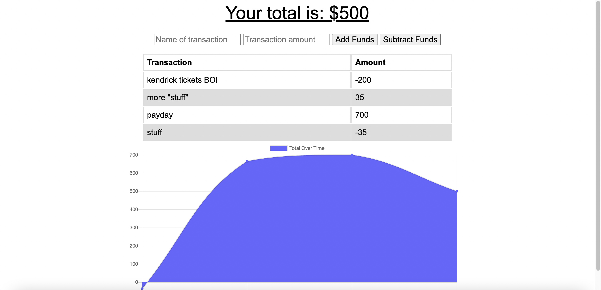

# Budget Tracker 

## Description 
This is an app that allows a user to track their budget based on transaction names and amounts. They can add to their budget or subtract from it using the add/subtract funds buttons. The table and graph will show a user their transactions and budget over time. This app can also be viewed offline using data from cache.

* Heroku Link
https://budget-tracker-cody-420692022.herokuapp.com/

## Table of Contents
* [Contribution](#contribution)

## Contribution 
I utilized my tutor and referenced previous module work and lessons to complete this assignment. 

